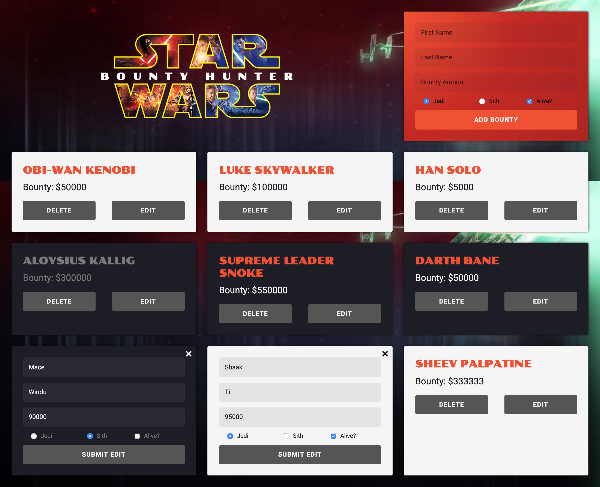

# The Original Bounty Hunter
### > For V School // Full Stack JavaScript // January 2019 Cohort

## Fully CRUD app using Mongoose and MongoDB backend with a responsive client-side React interface

#### Completed according to assignment instructions: 
- https://coursework.vschool.io/the-original-bounty-hunter/
- http://coursework.vschool.io/bounty-hunting-with-mongoose/

#### Demo:
<a href="https://original-bounty-hunter.herokuapp.com/">Original Bounty Hunter Demo</a>

<a href="https://original-bounty-hunter.herokuapp.com/"></a>

---

## Development

### Prerequisites
- Node.js ≥ 18
- MongoDB running locally (default port 27017)

### Getting Started

**Backend (Express + MongoDB)**
```bash
npm install
npm start          # starts Express server on http://localhost:7000
```

**Frontend (React + Vite)**
```bash
cd client
npm install
npm run dev        # starts Vite dev server on http://localhost:3000
```

The Vite dev server proxies `/bounty` requests to the Express backend at `http://localhost:7000`, so both servers need to be running during development.

### Available Client Scripts

| Command | Description |
|---------|-------------|
| `npm run dev` | Start the Vite dev server at [localhost:3000](http://localhost:3000) |
| `npm start` | Alias for `npm run dev` |
| `npm run build` | Build for production — output goes to `client/build/` |
| `npm run preview` | Locally preview the production build |

### Tech Stack

- [React 17](https://reactjs.org/) — UI library
- [Material UI v4](https://v4.mui.com/) — component library
- [Vite 7](https://vitejs.dev/) — build tool & dev server (migrated from Create React App)
- [Axios](https://axios-http.com/) — HTTP client
- [Express](https://expressjs.com/) — Node.js web framework
- [Mongoose](https://mongoosejs.com/) — MongoDB object modelling
- [Morgan](https://github.com/expressjs/morgan) — HTTP request logger
